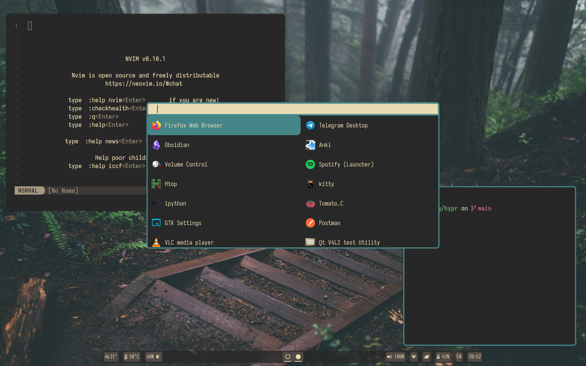
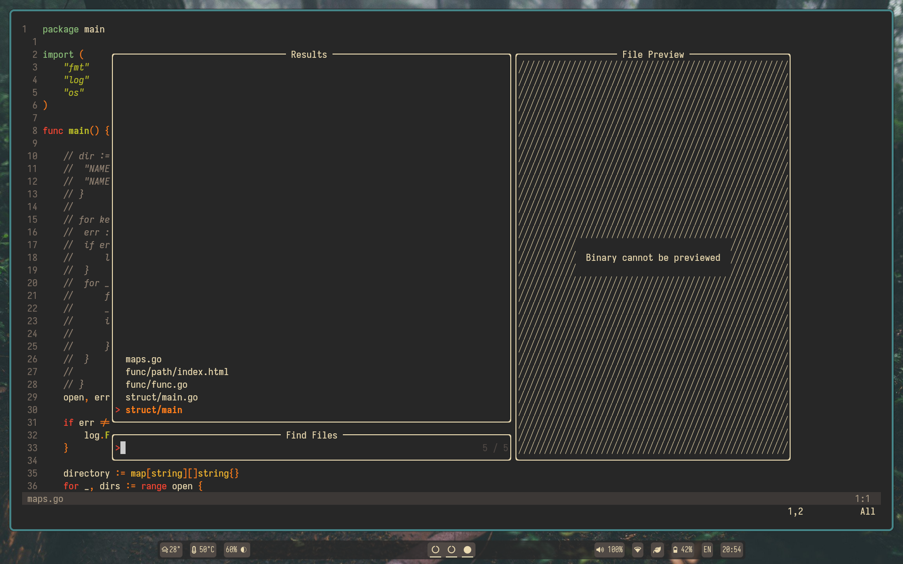
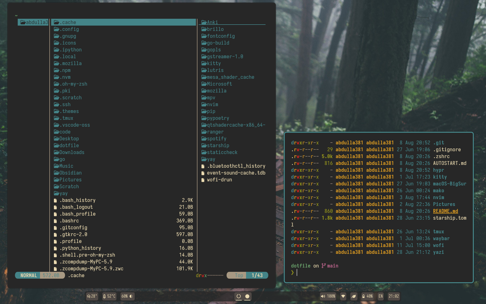

# Dotfile's Abdulla.

## About

Hey, everyone. I'm Abdulla.

This is my personal dotfiles repository.

This is my first go at hyprland. Created this repository to leave a future self finished build to share with everyone. I will improve or modify the build over time. [Installation guide](#setup).
### Core System Info
- Window Manager: [Hyprland](https://hyprland.org/)
- Wallpaper manager: [Hyprpaper](https://github.com/hyprwm/hyprpaper)
- Bar: [Waybar](https://github.com/Alexays/Waybar)
- Terminal: [Kitty](https://sw.kovidgoyal.net/kitty/)
- Editor: [Neovim](https://neovim.io/)
- Notification manager: [Mako](https://github.com/emersion/mako)
- App launcher: [Wofi](https://hg.sr.ht/~scoopta/wofi)
- Theme: [Gruvbox](https://github.com/morhetz/gruvbox)
- Font: [Iosevka Nerd Font](https://github.com/ryanoasis/nerd-fonts/releases/download/v3.2.1/Iosevka.zip)
- File manager: [Yazi](https://yazi-rs.github.io/)
- Promt: [Oh-my-zsh](https://ohmyz.sh/), [StarShip](https://github.com/starship/starship)
- Multiplexer: [Tmux](https://github.com/tmux/tmux/wiki)
- Screen locker: [Hyprlock](https://github.com/hyprwm/hyprlock)
## Setup
> [!note]
The names of the packages are from the AUR and Arch Repos; adapt them to your system. Most of the packages are available on other distros official repos (most of the time out-to-date). To install CLI/TUI specific packages in non-arch based distros, I recommend to use [homebrew](https://brew.sh/).

1. Install [yay](https://github.com/Jguer/yay)
```zsh
pacman -S --needed git base-devel
git clone https://aur.archlinux.org/yay.git
cd yay
makepkg -si
```

2. Install need packages
```zsh
sudo pacman -S hyprland, zsh, git, tmux, neovim, hyprpaper, hyprlock, starship, wofi, waybar, mako, yazi, curl, pulseaudio, zoxide, wl-clipboard, ripgrep, openssh, nwg-look, grim, firefox, networkmanager, gtk-engine-murrine, zip, unzip, imv
```

4. Install optional packages
```zsh
sudo pacman -S exa, obsidian, postgresql, python, go, syncthing, telegram-desktop, tree, vlc
```

5. Install Oh-my-zsh
```zsh
sh -c "$(curl -fsSL https://raw.githubusercontent.com/ohmyzsh/ohmyzsh/master/tools/install.sh)"
```

6. Install plugins for oh-my-zsh
```zsh
git clone https://github.com/zsh-users/zsh-syntax-highlighting.git ${ZSH_CUSTOM:-~/.oh-my-zsh/custom}/plugins/zsh-syntax-highlighting

git clone https://github.com/zsh-users/zsh-autosuggestions ${ZSH_CUSTOM:-~/.oh-my-zsh/custom}/plugins/zsh-autosuggestions

curl -sSL https://install.python-poetry.org | python3 -
```

7.  Install NVM
```zsh
curl -o- https://raw.githubusercontent.com/nvm-sh/nvm/v0.40.0/install.sh | bash
```

8. Install gruvbox gtk theme
	- https://www.pling.com/p/1681813 to download zip

```zsh
unzip Gruvbox-Dark-B.zip 
```

9. Install dotfiles
```zsh
git clone https://github.com/Abdulla38/dotfile2
cd dotfile
cp -r .config/* ~/.config/
```

10. Install font
	- https://www.nerdfonts.com/font-downloads to download font zip

```zsh
unzip font.zip
cd font
sudo mv *.ttf /usr/local/share/fonts
```

### Gallery







